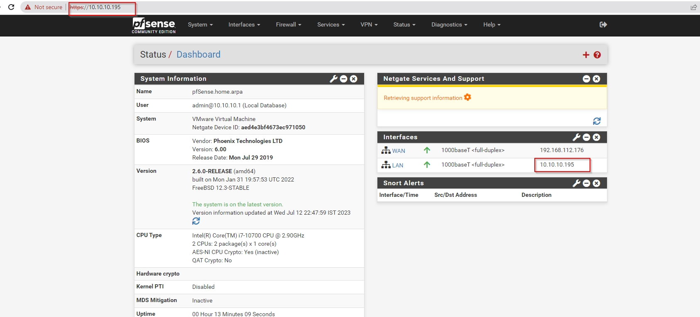
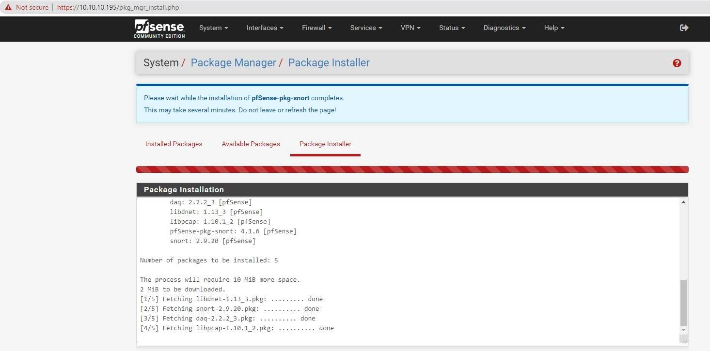
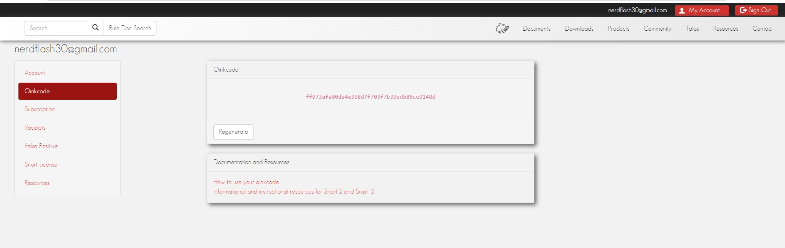
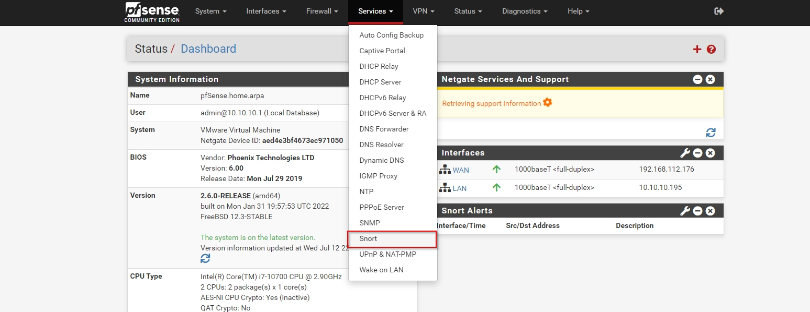
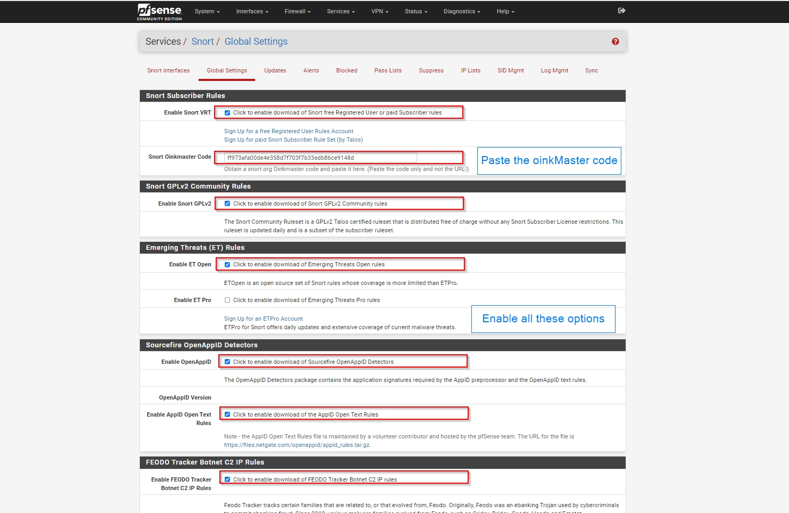
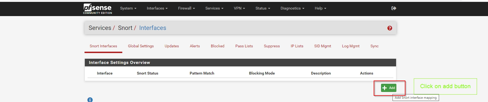
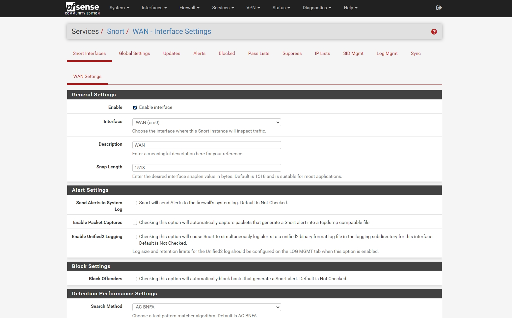
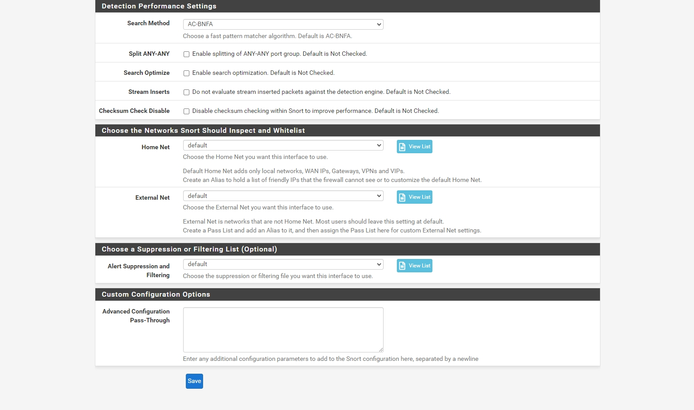

# PFSENSE

> Q.1 allow icmp traffic from any ip address

### Step 1: first download iso and install the pfsense firewall
 `access the pfsense firewall on LAN ip (i.e Host Only Network)`
 
### Step 2: install snort package in the pfsense
 

### Step 3: login into snort.org and copy the oinkcode into the pfsense's snort package
 
### Step 4: go to Services > snort 
 
### Step 5: go to Global setting on snort page, after changing th setting, click save 
 
### Step 6: go to snort interface setting on snort page and click add & keep all the default settings on WAN settings and click save 
 
 
 

10.10.10.163/2
